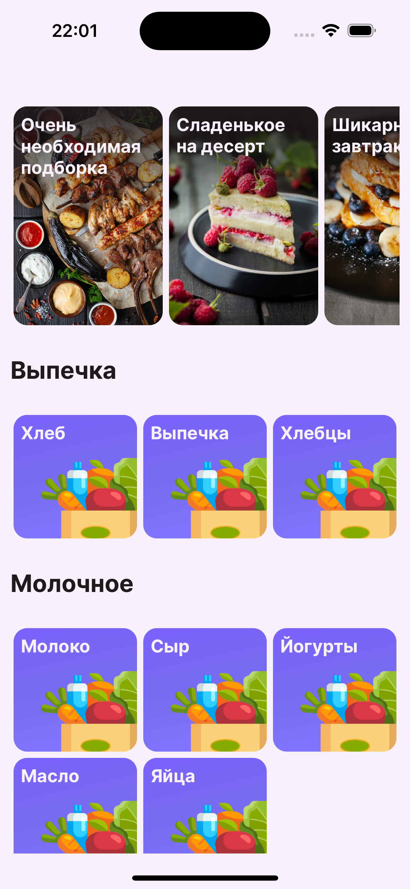
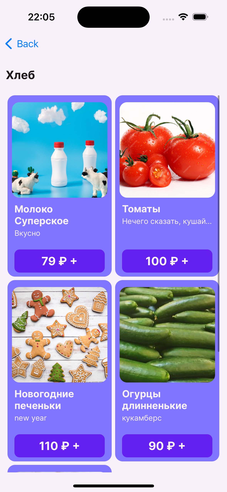

# Food Runner app for IOS

The app is a simple implementation of a food delivery service.

  
  
  
  

# Features
- Using UICollectionViewCompositionalLayout
- Custom Fonts
- VIPER
- Custom API on Python

# Acknowledgement
- Illustrations from [unsplash.com](https://unsplash.com)